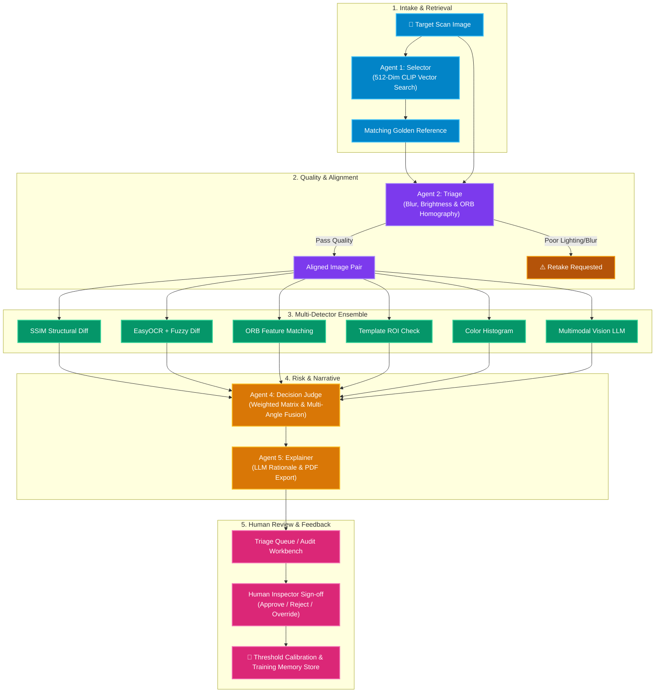
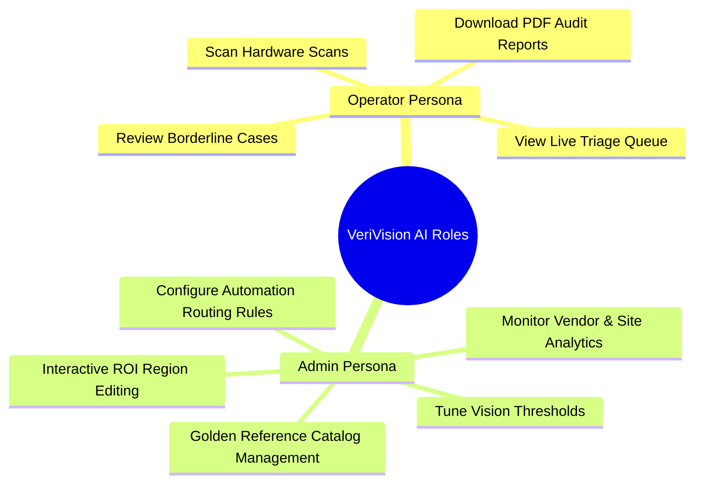
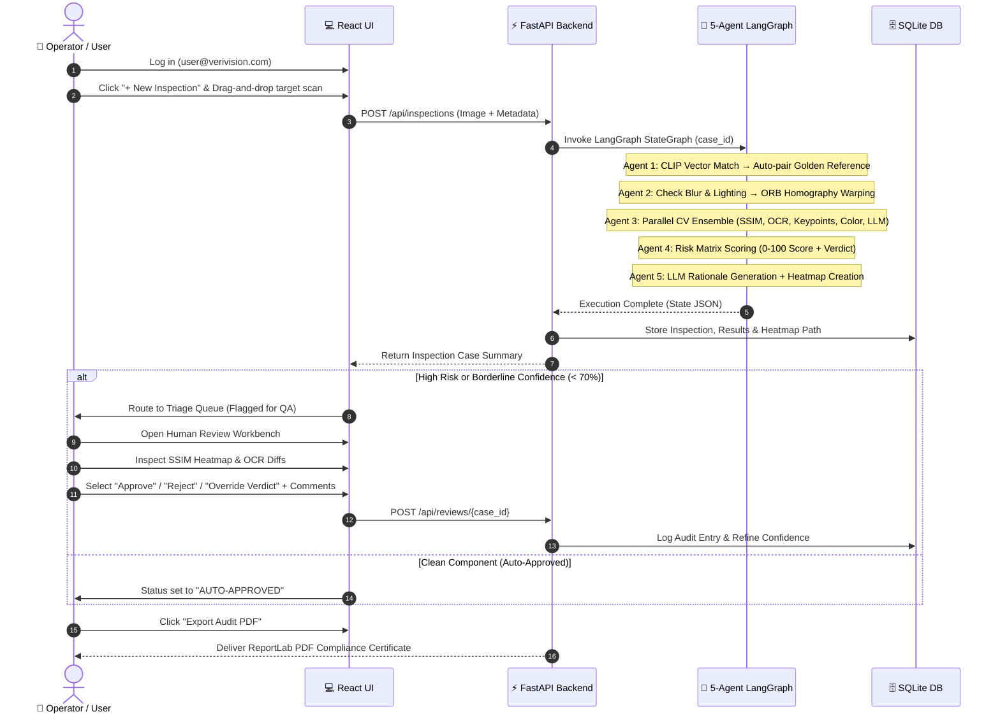
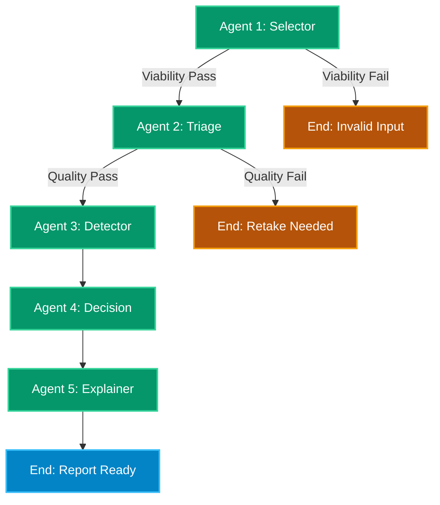
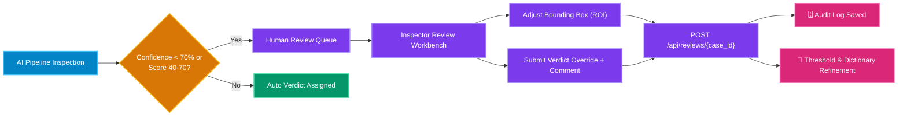

  

  
  
  

<h1 align="center">🤖 VeriVision AI — Agentic Workflow, User Roles & Deep-Dive Architecture</h1>

  <em>Comprehensive technical deep dive into the 5-Agent Computer Vision pipeline, FastAPI backend services, User vs. Admin workflows, PDF reporting engine, and Human-in-the-Loop (HITL) active learning loop.</em>

---

## 📑 Table of Contents
1. [🌐 High-Level Platform Overview](#-high-level-platform-overview)
2. [👥 User Roles: Operator vs. Admin Workspace](#-user-roles-operator-vs-admin-workspace)
3. [🚀 End-to-End User Demo Workflow](#-end-to-end-user-demo-workflow)
4. [🛠️ Deep Dive: The 5 LangGraph Agents](#️-deep-dive-the-5-langgraph-agents)
   - [Agent 1: Selector & Gatekeeper (`agent_1_selector.py`)](#agent-1--product-selector--gatekeeper-agent_1_selectorpy)
   - [Agent 2: Triage & Aligner (`agent_2_triage.py`)](#agent-2--ingest--triage-aligner-agent_2_triagepy)
   - [Agent 3: Vision-AI Anomaly Detector Ensemble (`agent_3_detector.py` & `agent_3_multimodal.py`)](#agent-3--vision-ai-anomaly-detector-ensemble-agent_3_detectorpy--agent_3_multimodalpy)
   - [Agent 4: Decision & Fusion Judge (`agent_4_decision.py`)](#agent-4--decision--fusion-judge-agent_4_decisionpy)
   - [Agent 5: Audit Explainer & Report Engine (`agent_5_explainer.py` & `reporting.py`)](#agent-5--audit-explainer--report-engine-agent_5_explainerpy--reportingpy)
5. [📄 Audit-Ready PDF & CSV Reporting System](#-audit-ready-pdf--csv-reporting-system)
6. [🧠 Human-in-the-Loop (HITL) Active Learning & Feedback Loop](#-human-in-the-loop-hitl-active-learning--feedback-loop)
7. [📊 Live Telemetry & Analytics Dashboard](#-live-telemetry--analytics-dashboard)
8. [⚡ Auto-Sync & Startup Background Warmup (`main.py` & `seed_db.py`)](#-auto-sync--startup-background-warmup-mainpy--seed_dbpy)

---

## 🌐 High-Level Platform Overview

> [!NOTE]
> **Autonomous Multi-Agent Architecture**: VeriVision AI orchestrates 5 autonomous AI agents built on **LangGraph** (`backend/app/agents/workflow.py`). Each agent operates as a specialized micro-service node, executing vector retrieval, quality triage, parallel computer vision, weighted risk fusion, and LLM audit explanations.

**VeriVision AI** automates hardware quality assurance and return fraud detection across global repair centers and manufacturing lines. By replacing manual visual inspection with an autonomous **5-Agent Computer Vision pipeline**, VeriVision reduces inspection times from hours to milliseconds while capturing subtle fraud indicators like 0-to-O character alterations on serial stickers, missing QC tags, non-OEM replacement covers, and reused boards.

  

---

## 👥 User Roles: Operator vs. Admin Workspace

VeriVision AI implements strict **Role-Based Access Control (RBAC)** to serve two primary operational personas in technical logistics environments:

### 1. 👷 Operator Inspector (`user@verivision.com` / `user123`)
*Target User: Line Engineers, Warehouse Technicians, QA Inspectors*
- **Primary Goal:** Rapidly verify incoming return parts, view AI findings, and process flagged items.
- **Access Scope:**
  - **AI Inspection Submission:** Upload part images via drag-and-drop, specify capture site, camera angle, vendor, and component batch.
  - **Live Triage Queue:** Filter assigned inspection items by status (`AUTO-APPROVED`, `PENDING QA`, `QUARANTINE`, `RETAKE REQUESTED`).
  - **Split-Panel Audit Workbench:** Inspect side-by-side golden vs target images, SSIM heatmaps, bounding box annotations, and OCR diffs.
  - **Human-in-the-Loop Review:** Approve AI verdicts or flag items for supervisor escalation.
  - **PDF Export:** Generate and download official laboratory inspection certificates.

### 2. 🔐 Admin Supervisor (`admin@verivision.com` / `admin123`)
*Target User: Quality Managers, Technical Directors, Supply Chain Analysts*
- **Primary Goal:** Calibrate AI detection sensitivity, manage catalog references, enforce compliance policies, and analyze vendor fraud trends.
- **Access Scope:**
  - **Full Operator Rights:** Access all operator submission, queue, and detail features across *all* operators and sites.
  - **Golden Reference Catalog Portal:** Upload new OEM master references, extract 512-dim visual embeddings, and set expected serial number patterns.
  - **Interactive ROI Canvas Editor:** Draw and adjust label bounding boxes (`label_roi`), logo templates (`template_roi`), and material inspection windows (`color_roi`).
  - **Admin Calibration Console:** Fine-tune live system thresholds in real-time:
    - *SSIM Sensitivity Threshold* (e.g., `0.85`)
    - *Keypoint Delta Allowance* (e.g., `15%`)
    - *OCR Fuzzy Match Strictness* (e.g., `100%`)
  - **Automation Policy Rules:** Define high-risk routing logic (e.g., *"If Commodity = Microchip → always route to manual QA"*).
  - **Vendor & Site Analytics Dashboard:** Track fraud frequency by vendor, capture site, component category, and monthly trend trajectory.

---

## 🚀 End-to-End User Demo Workflow

Here is the exact step-by-step walkthrough of how a user interacts with VeriVision AI during a live demo:

---

## 🛠️ Deep Dive: The 5 LangGraph Agents

VeriVision AI’s intelligence is powered by a **5-Agent LangGraph State Machine** (`backend/app/agents/workflow.py`). Each agent acts as an autonomous node with specialized responsibilities:

---

### Agent 1 — Product Selector & Gatekeeper (`agent_1_selector.py`)

#### Primary Responsibility
Identifies the exact OEM part catalog model from an incoming scan and verifies image comparison viability before heavy computation begins.

#### Technical Highlights
- **512-Dimensional Vector Indexing:** Utilizes **Open_CLIP (ViT-B/32)** (`embedding_service.py`) to extract a normalized 512-dimensional visual embedding vector. Performs Cosine Similarity search against indexed Golden References in `<10ms`.
- **Local OCR-Based Commodity Classifier:** Uses OCR text extraction combined with keyword mappings (`motherboard`, `label`, `microchip`, `processor`, `ram`, `storage`, `gpu`, `battery`) to auto-classify component type.
- **Viability Gatekeeper:**
  - File existence and decodability check on disk.
  - Aspect ratio orientation verification ($|\text{ar}_{\text{ref}} - \text{ar}_{\text{src}}| \le 0.4$, prevents comparing portrait vs landscape).
  - Resolution scale difference checks ($0.25 \le \text{ratio} \le 4.0$, prevents comparing 200px thumbnails against 4K images).

---

### Agent 2 — Ingest & Triage Aligner (`agent_2_triage.py`)

#### Primary Responsibility
Evaluates camera clarity, lighting conditions, and performs geometric image registration so target scans align perfectly with golden references.

#### Technical Highlights
- **Blur Detection (Laplacian Variance):** Computes $\text{Var}(\nabla^2 I)$. If score $< 100.0$, flags as blurry and requests an instant re-scan with user guidance (*"Hold camera steady and capture close-up"*).
- **Lighting Intensity Range:** Calculates mean pixel intensity $\mu$. Verifies brightness is within optimal bounds ($40 \le \mu \le 220$).
- **ORB Feature Homography Alignment:**
  - Extracts 2,000 ORB keypoints from both images.
  - Matches descriptors using `BFMatcher(NORM_HAMMING)`.
  - Calculates RANSAC Homography matrix $H$ with 5.0 pixel error threshold.
  - Enforces minimum RANSAC inlier ratio ($\ge 15\%$) and inlier count ($\ge 10$) to prevent invalid warping distortions.
- **Illumination Normalization:** Applies mean/std contrast matching in Lab color space ($L_{\text{norm}} = \frac{L_{\text{src}} - \mu_{\text{src}}}{\sigma_{\text{src}}} \cdot \sigma_{\text{ref}} + \mu_{\text{ref}}$) to standardize brightness across different factory lighting setups.

---

### Agent 3 — Vision-AI Anomaly Detector Ensemble (`agent_3_detector.py` & `agent_3_multimodal.py`)

#### Primary Responsibility
Executes **6 specialized sub-detectors** concurrently using Python `ThreadPoolExecutor`, eliminating bottlenecks and maximizing pipeline throughput (~3-5 seconds execution time).

#### The 6 Sub-Agents:

| Sub-Agent | Tech Stack / Engine | What It Catches | Metrics / Visual Output |
|:---|:---|:---|:---|
| **Agent 3A: Structural Inspector** | `skimage.metrics.structural_similarity` | Component swaps, missing chips, burnt traces, PCB layout changes | `ssim_score`, JET thermal heatmap, annotated target scan |
| **Agent 3B: OCR & Label Agent** | EasyOCR + `difflib.SequenceMatcher` | Altered serial numbers, missing stickers, character diffs | `ocr_similarity`, `ocr_mismatches` array with confusable tags |
| **Agent 3C: Keypoint Matcher** | `cv2.ORB` + Lowe's ratio test (0.75) | Assembly variations, swapped board layouts | `keypoint_ratio`, `good_matches` count |
| **Agent 3D: Template ROI Check** | `cv2.matchTemplate(TM_CCOEFF_NORMED)` | Missing QC seals, logo sticker presence | `template_match_score`, `template_match_found` boolean |
| **Agent 3E: Color Histogram** | `cv2.calcHist` (3D RGB/HSV correlation) | Non-OEM label paint hues, material deviations | `color_hist_similarity` correlation index |
| **Agent 3F: Multimodal Vision Agent** | **NVIDIA NIM** (`meta/llama-3.2-11b-vision-instruct`) | Semantic visual defects (scratches, cracks, solder residue, pin damage) | `multimodal_report` narrative text |

#### Visual Evidence Outputs Generated by Agent 3:
1. **SSIM Thermal Heatmap:** Generates glowing neon-red JET heatmap overlays highlighting structural difference zones.
2. **Annotated Target Scan:** Draws yellow and red bounding boxes around detected anomaly hotspots.
3. **Side-by-Side Diagnostic Card:** Merges Golden Standard, Target Scan (Defects Marked), and Thermal Heatmap into a unified composite image.

---

### Agent 4 — Decision & Fusion Judge (`agent_4_decision.py`)

#### Primary Responsibility
Evaluates detector outputs against strict business rules, applies weighted risk scoring, and assigns a final fraud score, verdict category, and recommended action.

#### Invariant Protection Rule
If the uploaded scan is pixel-identical to the golden reference (`source_reference_identical == True`), Agent 4 bypasses all risk rules and immediately returns: `verdict = "clean"`, `fraud_score = 0`, `recommended_action = "Accept"`.

#### Mathematical Risk Scoring Formula
$$\text{Fraud Score} = \min\left(100, \, 1.5 \times \sum (W_i \times L_i)\right)$$

Where Loss $L_i = 1.0 - \text{Similarity}_i$, and weights are allocated as:
- **SSIM Structural Loss:** $35\%$
- **OCR Text Mismatch Loss:** $20\%$
- **CLIP Vector Embedding Loss:** $15\%$
- **Keypoint Descriptor Loss:** $15\%$
- **Template / Logo Loss:** $10\%$
- **Color Histogram Loss:** $5\%$

```mermaid
gantt
    title Decision Matrix Weight Allocations
    dateFormat X
    section Weights
    SSIM Structural Diff (35%) : active, 0, 35
    OCR Text Difference (20%) : crit, 35, 55
    CLIP Vector Search (15%) : 55, 70
    Keypoint Matching (15%) : 70, 85
    Template ROI Check (10%) : 85, 95
    Color Correlation (5%) : 95, 100
```

#### Verdict Hierarchy:
1. **Missing QC Label** $\rightarrow$ `missing` (Score $70$, Action: *Quarantine & Escalate*)
2. **OCR Unreadable** $\rightarrow$ `missing` (Score $25$, Action: *Request Additional Angle*)
3. **Swap Detection** $\rightarrow$ `tampered` (Score $75$, Action: *Quarantine & Escalate*)
4. **Altered Serial Number** $\rightarrow$ `mismatched` (Score $50$, Action: *Escalate with evidence*)
5. **Non-OEM Label** $\rightarrow$ `mismatched` (Score $40$, Action: *Escalate to vendor*)
6. **Reused Board** $\rightarrow$ `reused` (Score $35$, Action: *Request Additional Angle*)
7. **Clean Part** $\rightarrow$ `clean` (Score $0-15$, Action: *Accept*)

#### Multi-Angle Fusion Engine
Combines evaluation scores from 2–3 camera views (e.g., Top 0°, Side 45°, Profile 90°) of the same part using **Noisy-OR Probabilistic Fusion**:
$$P(\text{Fraud}_{\text{fused}}) = 1 - \prod_{i=1}^{N} \left(1 - \frac{S_i}{100}\right)$$

---

### Agent 5 — Audit Explainer & Report Engine (`agent_5_explainer.py` & `reporting.py`)

#### Primary Responsibility
Translates complex mathematical metrics into audit-ready, fluent natural language narratives for executive compliance reports.

#### Technical Highlights
- **Primary LLM Generation:** Calls NVIDIA NIM Text LLM (`meta/llama-3.1-8b-instruct`) with strict grounding rules:
  - ABSOLUTELY NO raw pixel math or coordinate tuples like `(x=137, y=109)`.
  - Converts pixel locations into plain English (e.g., *"center label zone"*, *"upper PCB component area"*).
  - Grounded strictly in Agent 4's verdict and decision reasoning.
- **Deterministic Local Template Fallback:** If offline or API fails, constructs a structured bullet summary (`• Part Status`, `• Visual Findings`, `• Serial Check`, `• Inspector Action Item`) followed by a multi-sentence executive narrative paragraph.

---

## 📄 Audit-Ready PDF & CSV Reporting System

VeriVision AI generates laboratory-grade PDF reports via **ReportLab** (`backend/app/services/reporting.py`).

### PDF Audit Certificate Contents:
1. **Document Header:** Company logo, document title, timestamp, case UUID.
2. **Metadata Grid:** Case ID, Part Code, Capture Site, Camera Angle, Inspector Email, Pipeline Version (`FraudSense v4.2`), Image Hash.
3. **Verdict Banner:** Color-coded verdict (`CLEAN`, `TAMPERED`, `MISSING`, `MISMATCHED`, `REUSED`), Fraud Score (0-100), AI Confidence %, Recommended Action.
4. **Visual Evidence Triad:** Side-by-side display of **Golden Reference**, **Target Scan**, and **SSIM Anomaly Heatmap**.
5. **Detector Metrics Table:** SSIM index, keypoint match %, expected vs detected OCR string.
6. **OCR Character-Level Diff Grid:** Table mapping each string position, expected character, detected character, and match status (`MATCH` / `MISMATCH`).
7. **Supervisor Audit Log Trail:** Complete history of human reviews, including actor name, previous verdict, updated verdict, timestamp, and comments.

---

## 🧠 Human-in-the-Loop (HITL) Active Learning & Feedback Loop

The **Human Review Workbench** (`frontend/src/pages/HumanReviewPage.jsx`) bridges automated AI detection with human domain expertise:

---

## 📊 Live Telemetry & Analytics Dashboard

The **Analytics Dashboard** (`frontend/src/pages/AnalyticsDashboardPage.jsx`) provides global supply chain visibility:
- **Vendor Trust Index:** $100 - (\text{Fraud Rate} \times 1.5)$
- **Repeat Offender Alerts:** Flags vendors supplying $\ge 3$ fraud cases within 30 days.
- **Commodity Breakdown:** Distribution of defects across motherboards, RAM, storage, GPUs, microchips.
- **Bulk CSV Export:** One-click CSV download of all case outcomes formatted for ERP ingestion.

---

## ⚡ Auto-Sync & Startup Background Warmup (`main.py` & `seed_db.py`)

To ensure FastAPI starts listening on port 8000 in under **200ms** without blocking HTTP requests or causing connection refusals:
1. `main.py` launches a background daemon thread (`start_background_warmup()`).
2. The thread pre-warms **EasyOCR** and **Open_CLIP** models into memory.
3. Automatically executes `seed_db.py` to sync any images placed in the `Golden_Images` root folder directly into `verivision.db` and extract 512-dim visual embeddings.

---

  <strong>VeriVision AI — Built for the Dell FutureMind AI Hackathon Grand Final 2026</strong> 
  <em>Team 24x7: Utkar Sinha · Mishkan Gupta · Somya Sagar Naik · Abhijit Chaudhary · Subham Sadangi</em>

