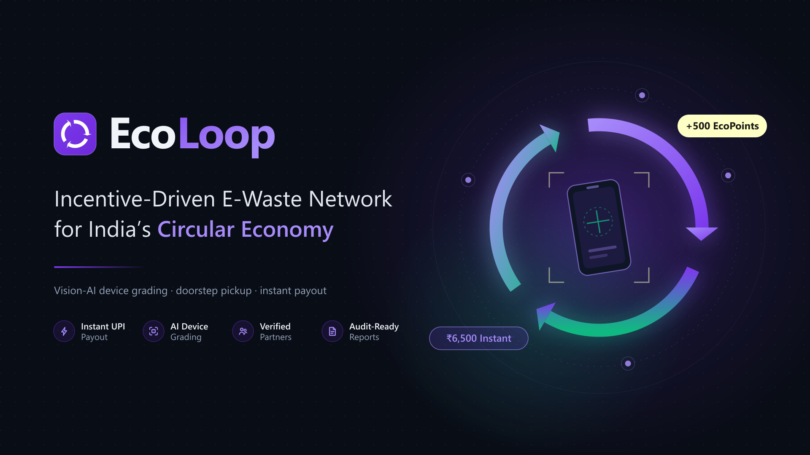
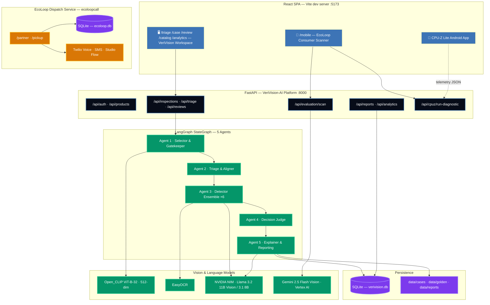
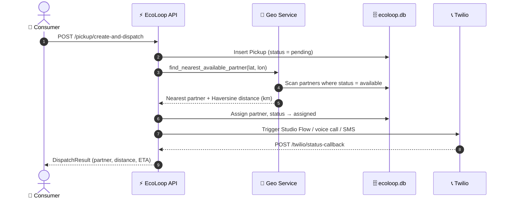
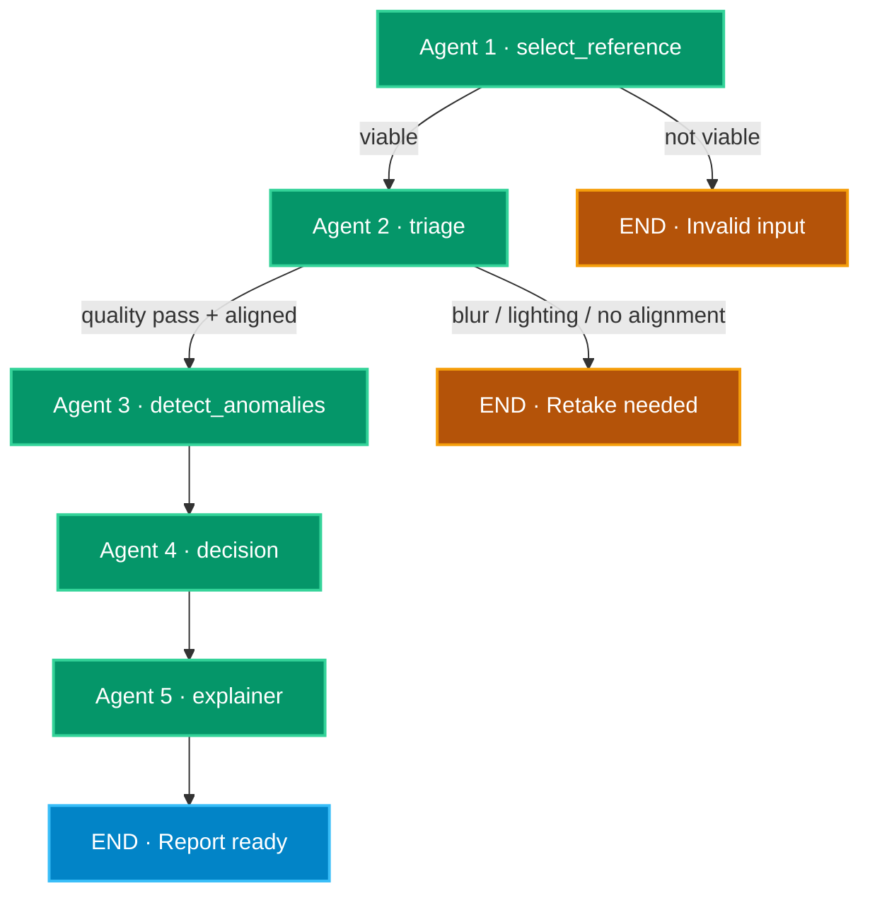
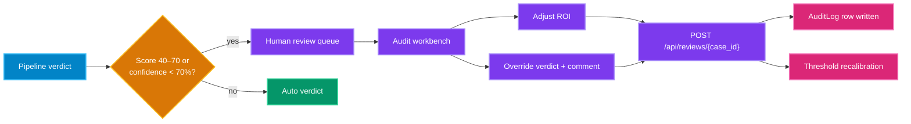
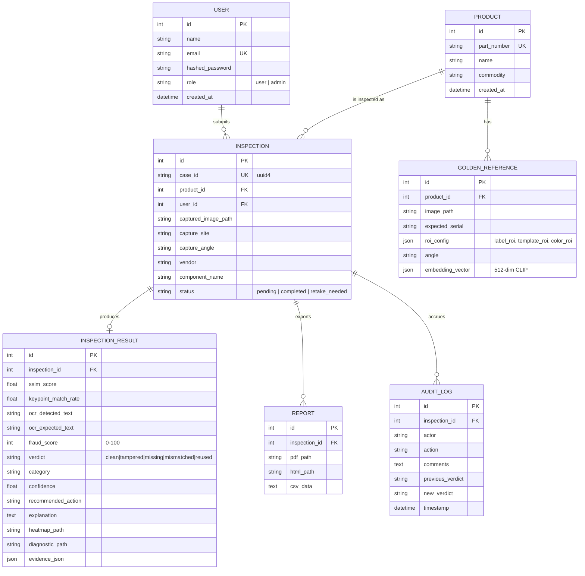

<p align="center">
  
</p>

<p align="center">
  
  
  
  
</p>

<p align="center">
  
  
  
  
  
  
  
  
</p>

<h1 align="center">♻️ EcoLoop</h1>

<h3 align="center">
  <em>An incentive-driven e-waste network, backed by an autonomous 5-agent computer-vision inspection engine</em>
</h3>

---

## 📑 Table of Contents

1. [What This Repository Contains](#-what-this-repository-contains)
2. [The Problem & The Model](#-the-problem--the-model)
3. [System Architecture](#-system-architecture)
4. [Repository Layout](#-repository-layout)
5. [Quickstart](#-quickstart)
6. [Subsystem 1 — VeriVision AI Backend](#-subsystem-1--verivision-ai-backend-backend)
7. [Subsystem 2 — React Web Application](#-subsystem-2--react-web-application-frontend)
8. [Subsystem 3 — EcoLoop Dispatch & Twilio Service](#-subsystem-3--ecoloop-dispatch--twilio-service-ecoloopcall)
9. [Subsystem 4 — CPU-Z Lite Android Prototype](#-subsystem-4--cpu-z-lite-android-prototype-cpu-z-prototype)
10. [The 5-Agent Inspection Pipeline](#-the-5-agent-inspection-pipeline)
11. [API Reference](#-api-reference)
12. [Data Model](#-data-model)
13. [Configuration & Environment Variables](#-configuration--environment-variables)
14. [Consumer Incentive Engine](#-consumer-incentive-engine)
15. [Revenue Model](#-revenue-model)
16. [Testing](#-testing)
17. [Docker Deployment](#-docker-deployment)
18. [Troubleshooting](#-troubleshooting)
19. [Team](#-team)
20. [License & Credits](#-license--credits)

---

## 📦 What This Repository Contains

EcoLoop is a **monorepo** holding four independent but interlocking subsystems. They share a single React shell and a single FastAPI process for the web experience, plus two standalone components.

| # | Subsystem | Path | Stack | What It Does |
|:--|:---|:---|:---|:---|
| 1 | **VeriVision AI Backend** | `backend/` | FastAPI · LangGraph · OpenCV · EasyOCR · Open_CLIP · SQLAlchemy | 5-agent computer-vision pipeline that compares a scanned hardware part against a golden OEM reference and returns a fraud verdict, score, heatmap, and audit PDF. Also hosts the EcoLoop device-valuation and CPU-Z diagnostics endpoints. |
| 2 | **React Web Application** | `frontend/` | React 18 · Vite 5 · TailwindCSS 3 · Recharts | Single-page app serving two personas: the **VeriVision inspection workspace** (triage queue, audit workbench, admin console, analytics) and the **EcoLoop consumer mobile scanner** at `/mobile`. |
| 3 | **EcoLoop Dispatch Service** | `ecoloopcall/` | FastAPI · SQLAlchemy · Twilio | Standalone service for kabadiwala partner registry, pickup requests, Haversine nearest-partner geo-matching, and Twilio voice/SMS/Studio-Flow dispatch. Ships with its own small React frontend. |
| 4 | **CPU-Z Lite** | `CPU-Z prototype/` | Kotlin · Jetpack Compose · Hilt · MVVM | Native Android app that reads real on-device hardware telemetry (CPU, RAM, battery, storage, display, sensors, network, camera) and dumps it as JSON for device-condition grading. |

> [!NOTE]
> The two backends are **separate FastAPI applications with separate SQLite databases** and are started independently. `backend/` serves the main platform on port `8000`; `ecoloopcall/` is its own service, also defaulting to port `8000` — run it on a different port if you need both at once.

---

## 🌐 The Problem & The Model

India's e-waste stream is dominated by informal *kabadiwalas* because they offer **instant cash, doorstep pickup, and zero friction**. Formal recyclers cannot match those incentives, so material leaks out of the compliant chain. EcoLoop's premise is not to compete with kabadiwalas but to **formalize and equip them**.

```
CURRENT INFORMAL MODEL
Consumer  ──►  Kabadiwala (guesses value)  ──►  Local scrap dealer  ──►  Environmental leakage

ECOLOOP CIRCULAR MODEL
Consumer  ──►  Verified Partner (UID: KBD-9402)  ──►  EcoLoop AI Network  ──►  Refurbishers / Recyclers / Brands
               (earns pickup commission)            (OCR + Vision AI grading)   (instant digital UPI payout)
```

Three mechanisms make the loop work:

1. **🤝 Partner Network** — each collector gets a verified Partner UID, fixed pickup commissions, monthly performance bonuses, and access to national B2B refurbishers.
2. **📱 AI-Assisted Valuation** — the consumer photographs the device; OCR extracts visible brand/model text, vision AI grades physical condition, and the CPU-Z SDK validates internal hardware health. Price is computed, not guessed.
3. **🛵 Doorstep Pickup & Instant Payout** — the nearest available partner is dispatched by geo-match, confirms condition with their UID, and the consumer is paid immediately with no middleman deduction.

Behind the consumer flow, **VeriVision AI** is the same vision engine applied to the B2B side: verifying that returned and refurbished hardware is genuine, unaltered, and correctly labelled before it re-enters the supply chain.

---

## 🛠️ System Architecture



---

## 📁 Repository Layout

```text
EcoLoop/
├── backend/                          # VeriVision AI — FastAPI platform
│   ├── app/
│   │   ├── main.py                   # App factory, CORS, routers, background model warmup
│   │   ├── config.py                 # Settings: keys, paths, vision thresholds
│   │   ├── database.py               # SQLAlchemy engine, SessionLocal, get_db()
│   │   ├── models.py                 # User, Product, GoldenReference, Inspection,
│   │   │                             #   InspectionResult, Report, AuditLog
│   │   ├── schemas.py                # Pydantic request/response models
│   │   ├── utils.py                  # Password hashing, JWT, role guards, image loading
│   │   ├── agents/
│   │   │   └── workflow.py           # LangGraph StateGraph — the 5-node pipeline
│   │   ├── routers/
│   │   │   ├── auth.py               # Register / login / me
│   │   │   ├── products.py           # Catalog CRUD + golden reference upload
│   │   │   ├── inspections.py        # Submit scan, list, detail, delete, multi-angle fusion
│   │   │   ├── triage.py             # Queue, stats, case detail, ROI editing, live thresholds
│   │   │   ├── reviews.py            # Human-in-the-loop verdict override & audit log
│   │   │   ├── reports.py            # PDF certificate + CSV bulk export
│   │   │   ├── analytics.py          # Vendor / site / repeat-offender / trend analytics
│   │   │   ├── evaluation.py         # EcoLoop device valuation & intelligence report
│   │   │   └── cpuz.py               # CPU-Z hardware diagnostic extraction
│   │   └── services/
│   │       ├── agent_1_selector.py   # Viability gatekeeping, commodity classification
│   │       ├── agent_2_triage.py     # Blur / brightness checks, ORB homography alignment
│   │       ├── agent_3_detector.py   # SSIM, OCR, keypoints, template, colour ensemble
│   │       ├── agent_3_multimodal.py # Vision-LLM semantic defect narrative
│   │       ├── agent_4_decision.py   # Weighted risk fusion, verdict, multi-angle Noisy-OR
│   │       ├── agent_5_explainer.py  # LLM audit narrative + deterministic fallback
│   │       ├── embedding_service.py  # Open_CLIP 512-dim vectors, cosine search
│   │       └── reporting.py          # ReportLab PDF certificates, CSV export
│   ├── tests/
│   │   └── test_inspection_pipeline.py
│   ├── seed_db.py                    # Migrations, default accounts, Golden_Images sync
│   ├── requirements.txt
│   └── .env.example
│
├── frontend/                         # React + Vite SPA (VeriVision workspace + EcoLoop mobile)
│   ├── src/
│   │   ├── routes/AppRoutes.jsx      # Route table
│   │   ├── pages/                    # Landing, Login, AIInspection, InspectionDetail,
│   │   │                             #   HumanReview, AdminConsole, Analytics, MobileScanner
│   │   ├── components/               # Auth, Case, Common, Feedback, Layout, Review,
│   │   │                             #   Triage, TargetScanCaptureZone, UploadInspectionModal
│   │   ├── context/                  # AuthContext, CaseContext
│   │   ├── hooks/                    # useAuth, useCases, useReview, useFeedbackConfig
│   │   ├── services/                 # Thin fetch wrapper + one module per API domain
│   │   └── utils/                    # constants, formatDate, formatScore, statusColor
│   ├── public/images/                # Banner, architecture diagram, demo samples
│   ├── vite.config.js                # Dev proxy → :8000 for /api /data /dataset
│   └── tailwind.config.js            # Theme tokens, colour-blind-safe risk scale
│
├── ecoloopcall/                      # EcoLoop dispatch & Twilio service
│   ├── app/                          # config, database, models (Partner, Pickup), schemas, main
│   ├── routers/                      # partner_router, pickup_router, twilio_router
│   ├── services/                     # partner, pickup, geo (Haversine), dispatch,
│   │                                 #   notification, sms, twilio, twilio_studio
│   ├── frontend/                     # Small React app: ConsumerForm + StatusTracker
│   ├── create_twilio_flow.py         # Provisions the Studio Flow from studio_flow.json
│   └── studio_flow.json
│
├── CPU-Z prototype/                  # Native Android hardware telemetry app
│   ├── app/src/main/java/com/cpuz/lite/
│   │   ├── managers/                 # One manager per hardware subsystem
│   │   ├── model/                    # Immutable data classes per subsystem
│   │   ├── viewmodel/                # One ViewModel per screen (StateFlow)
│   │   ├── ui/                       # Compose screens, components, theme, navigation
│   │   └── MainActivity.kt
│   ├── app/src/androidTest/.../SpecDumperTest.kt   # On-device spec dump to JSON
│   ├── APK/CPU-Z-Lite.apk            # Prebuilt installer
│   ├── dump_specs.ps1                # Build → deploy → run test → fetch JSON
│   └── memory.md                     # Project context & build notes
│
├── Golden_Images/                    # Reference catalog (motherboard, ram, ssd)
├── Dockerfile                        # Two-stage build: Vite bundle + Python runtime
├── start.bat                         # Windows dev launcher (both servers + Chrome)
├── AGENTS.md                         # Deep-dive agent & workflow documentation
└── LICENSE.md                        # MIT
```

---

## 🚀 Quickstart

### Prerequisites

| Requirement | Version | Needed For |
|:---|:---|:---|
| Python | 3.10+ | Both FastAPI backends |
| Node.js | 18+ | React frontends |
| Git | any | Cloning |
| Tesseract OCR | latest | Optional OCR fallback path |
| JDK | 21 | CPU-Z Lite Android build only |
| Android SDK | API 34 | CPU-Z Lite Android build only |

> First backend start downloads the EasyOCR and Open_CLIP ViT-B-32 weights (~1 GB). This happens on a background thread, so the API is reachable immediately, but the first inspection will be slower than subsequent ones.

### 1. Clone

```bash
git clone https://github.com/uselessdevloper/EcoLoop.git
```

### 2. Backend

```bash
cd EcoLoop/backend && python -m venv venv && source venv/bin/activate && pip install -r requirements.txt && cp .env.example .env && python seed_db.py && python -m uvicorn app.main:app --reload --port 8000
```

On Windows PowerShell, activate with `.\venv\Scripts\Activate.ps1` and copy with `copy .env.example .env`.

### 3. Frontend

```bash
cd EcoLoop/frontend && npm install && npm run dev
```

### 4. Open

| Surface | URL |
|:---|:---|
| VeriVision workspace | `http://localhost:5173` |
| EcoLoop mobile scanner | `http://localhost:5173/mobile` |
| Swagger UI | `http://localhost:8000/docs` |
| ReDoc | `http://localhost:8000/redoc` |

### Default seeded accounts

| Role | Email | Password | Can Do |
|:---|:---|:---|:---|
| **Admin** | `admin@verivision.com` | `admin123` | Everything, plus catalog management, ROI editing, threshold calibration, analytics |
| **Operator** | `user@verivision.com` | `user123` | Submit inspections, work the triage queue, review cases, export PDFs |

> [!WARNING]
> These are development seed credentials. Change `SECRET_KEY` in `backend/.env` and remove or rotate the seeded accounts before any real deployment.

### One-command launch on Windows

`start.bat` at the repo root kills anything on ports 8000/5173, runs `seed_db.py`, opens both servers in separate consoles, and launches Chrome at `localhost:5173`. It requires `frontend/node_modules` to already exist.

```bash
start.bat
```

---

## ⚙️ Subsystem 1 — VeriVision AI Backend (`backend/`)

A FastAPI application titled **VeriVision-AI Platform**, mounting nine routers under the `/api` prefix.

### Startup sequence

1. `Base.metadata.create_all()` builds any missing tables.
2. `ensure_sqlite_schema_compatibility()` adds `diagnostic_path` and `evidence_json` to `inspection_results` if an older DB is present.
3. CORS is opened to `http://localhost:5173` and `http://127.0.0.1:5173`.
4. Routers register; `data/` and `dataset/` are mounted as static directories so the UI can fetch heatmaps and evidence images.
5. A **daemon thread** pre-warms EasyOCR and Open_CLIP, then runs `seed_db.seed()` to sync anything dropped into `Golden_Images/` into the catalog with fresh 512-dim embeddings. The HTTP server starts listening immediately and does not wait on this.
6. If `frontend/dist` exists, its assets are mounted and unmatched non-`/api` paths fall back to `index.html`, so a single container can serve both tiers.

### Key implementation notes

- **Auth** — JWT, HS256, 24-hour expiry (`ACCESS_TOKEN_EXPIRE_MINUTES = 1440`). Passwords hashed with passlib/bcrypt. `utils.require_role(["admin"])` guards admin-only routes.
- **Golden reference resolution** — an inspection can name a catalog `part_number` *or* upload a custom reference inline. The catalog path probes four candidate locations on disk and will copy from `Golden_Images/` into `data/golden/` as a fallback.
- **Input validation** — uploads must decode via OpenCV and be at least 150×150 px.
- **Live threshold overrides** — `PUT /api/triage/pipeline/config` writes into an in-process config that Agent 4 reads at decision time, so operators can retune SSIM sensitivity and OCR strictness without a restart.
- **Static evidence** — every case writes `{case_id}_heatmap`, `{case_id}_annotated`, and `{case_id}_diagnostic` images into `data/cases/`.

---

## 💻 Subsystem 2 — React Web Application (`frontend/`)

React 18.3 + Vite 5 + TailwindCSS 3.4, with `react-router-dom` 6, `recharts` 3.9 for analytics, and `lucide-react` for icons.

### Routes

| Path | Page | Access |
|:---|:---|:---|
| `/` | Landing page | Public |
| `/mobile`, `/scan` | **EcoLoop Mobile Scanner** — camera capture, device grading, payout report | Public |
| `/login` | Login | Public |
| `/triage` | AI Inspection — submit scans, live queue | Protected |
| `/case/:id` | Split-panel audit workbench — golden vs target, SSIM heatmap, OCR diff | Protected |
| `/review` | Human review workbench — approve, reject, override | Protected |
| `/catalog` | Admin console — golden references, ROI canvas, thresholds, routing rules | Protected |
| `/analytics` | Vendor / site / trend dashboard | Protected |
| `*` | Not found | Public |

### Conventions

- **One API wrapper.** `src/services/api.js` exports `apiRequest`, which injects the bearer token from `localStorage`, handles `FormData` vs JSON bodies, and raises a typed `ApiError`. Every domain service (`caseService`, `reviewService`, `analyticsService`, `cpuzService`, …) goes through it.
- **Relative base URL.** `API_BASE_URL` defaults to `/api`; the Vite dev proxy forwards `/api`, `/data`, and `/dataset` to `http://localhost:8000`. Override with `VITE_API_BASE_URL` for staging or production.
- **Theming.** Tailwind maps design tokens to CSS variables (`--bg-app`, `--bg-surface`, `--border-subtle`, …) with class-based dark mode. The risk scale is deliberately colour-blind-safe: emerald / amber / orange / crimson.

---

## 📞 Subsystem 3 — EcoLoop Dispatch & Twilio Service (`ecoloopcall/`)

A self-contained FastAPI service handling the logistics half of the loop.

```bash
cd ecoloopcall && pip install -r requirements.txt && cp .env.example .env && uvicorn app.main:app --reload --port 8001
```

Its own React client lives in `ecoloopcall/frontend/` (`npm install && npm run dev`) and provides a consumer request form plus a live status tracker. A dependency-free `standalone.html` is included for demos without a build step.

### Dispatch flow



On startup the service auto-creates tables and seeds three demo partners (Rajesh, Amit, Suresh). Routers are registered **twice** — once under `/api/v1` and once at the root — so both `POST /pickup` and `POST /api/v1/pickup` resolve.

`create_twilio_flow.py` provisions the Studio Flow described by `studio_flow.json` against your Twilio account.

---

## 📱 Subsystem 4 — CPU-Z Lite Android Prototype (`CPU-Z prototype/`)

Native Android app that supplies the hardware-truth layer for device valuation — the internal condition signals a photo cannot capture.

| Property | Value |
|:---|:---|
| Package | `com.cpuz.lite` |
| Language / UI | Kotlin · Jetpack Compose · Material 3 |
| Architecture | MVVM + Repository, Hilt 2.51.1 DI, Coroutines + StateFlow |
| Min / Target SDK | 26 (Android 8.0) / 34 (Android 14) |
| Build | Gradle 8.7 · AGP 8.5.0 |
| Prebuilt APK | `CPU-Z prototype/APK/CPU-Z-Lite.apk` |

Ten manager classes each own one hardware subsystem — `DeviceManager`, `CpuManager`, `MemoryManager`, `BatteryManager`, `StorageManager`, `DisplayManager`, `SensorManager`, `NetworkManager`, `CameraManager` — surfaced through `DeviceRepository` into per-screen ViewModels.

`SpecDumperTest.kt` is an instrumentation test that runs on the device and dumps a full spec JSON to the terminal; `dump_specs.ps1` automates compile → deploy → run → fetch. The resulting JSON is what the backend consumes as `hardware_diagnostics_json` on `POST /api/evaluation/scan`.

```bash
cd "CPU-Z prototype" && ./gradlew assembleDebug
```

The backend's `/api/cpuz/run-diagnostic` endpoint mirrors this for desktop targets: on macOS it shells out to `system_profiler`, and elsewhere it reads live CPU, RAM, storage, and battery figures via `psutil`, falling back to representative values when a sensor is unavailable.

---

## 🤖 The 5-Agent Inspection Pipeline

The pipeline is a compiled **LangGraph `StateGraph`** in `backend/app/agents/workflow.py`, driving a single `InspectionState` TypedDict. Entry point is `select_reference`; two conditional edges can short-circuit to `END`.



### Agent 1 — Selector & Gatekeeper (`agent_1_selector.py`)

Identifies the catalog part and refuses comparisons that cannot possibly be meaningful, before any expensive computation runs.

- **512-dim vector search** — Open_CLIP ViT-B-32 (OpenAI weights) embeds the scan and cosine-matches it against indexed golden references. Minimum accepted match score is `0.55`. The loader caches a `"FAILED"` sentinel rather than a falsy value, so a one-off init failure is logged once at CRITICAL and can be retried without a process restart instead of silently degrading every later case to the histogram fallback.
- **Commodity classification** — OCR text plus keyword maps (`motherboard`, `label`, `microchip`, `processor`, `ram`, `storage`, `gpu`, `battery`).
- **Viability gates** — file decodability, aspect-ratio delta ≤ 0.4 (blocks portrait-vs-landscape), and resolution ratio within 0.25–4.0 (blocks a thumbnail against a 4K capture).

### Agent 2 — Triage & Aligner (`agent_2_triage.py`)

Decides whether the photograph is usable, then geometrically registers it onto the reference.

- **Blur** — Laplacian variance; below `100.0` triggers a retake request with capture guidance.
- **Lighting** — mean pixel intensity must sit within `40 … 220`.
- **Alignment** — 2,000 ORB keypoints, `BFMatcher(NORM_HAMMING)`, RANSAC homography at 5.0 px reprojection error, requiring ≥ 15 % inlier ratio and ≥ 10 inliers before the warp is trusted.
- **Illumination normalisation** — mean/std contrast matching in Lab space, so different factory lighting does not read as a material difference.

The agent reports `alignment_status` as `aligned` only when homography genuinely converged. Any other value tells Agent 4 that geometric evidence is unreliable — this flag materially changes the scoring weights downstream.

### Agent 3 — Detector Ensemble (`agent_3_detector.py`, `agent_3_multimodal.py`)

Six detectors run concurrently in a `ThreadPoolExecutor`.

| Detector | Engine | Catches | Output |
|:---|:---|:---|:---|
| **3A · Structural** | `skimage.metrics.structural_similarity` | Component swaps, missing chips, burnt traces, layout changes | `ssim_score`, JET heatmap, annotated scan |
| **3B · OCR & Label** | EasyOCR + `difflib.SequenceMatcher` | Altered serials, missing stickers, 0↔O confusables | `ocr_similarity`, `ocr_mismatches[]` |
| **3C · Keypoint** | `cv2.ORB` + Lowe ratio 0.75 | Assembly variation, swapped boards | `keypoint_ratio`, `good_matches` |
| **3D · Template ROI** | `cv2.matchTemplate(TM_CCOEFF_NORMED)` | Missing QC seals, absent logos | `template_match_score`, `template_match_found` |
| **3E · Colour histogram** | `cv2.calcHist` 3D correlation | Non-OEM paint hues, material deviation | `color_hist_similarity` |
| **3F · Multimodal vision** | NVIDIA NIM `meta/llama-3.2-11b-vision-instruct` | Semantic defects — scratches, cracks, solder residue, pin damage | `multimodal_report` narrative |

Three evidence images are produced per case: a thermal SSIM heatmap, an annotated target with bounding boxes, and a merged side-by-side diagnostic card.

### Agent 4 — Decision Judge (`agent_4_decision.py`)

**Invariant first.** If the decoded upload is byte-identical to the golden reference (`source_reference_identical`), every risk rule is bypassed: `clean`, score `0`, action `Accept`. Interpolation artefacts from warping and OCR misreads are not evidence of fraud when the image *is* the reference.

**Weighted scoring**, with the multiplier capped at 100:

$$\text{Fraud Score} = \min\left(100,\; 1.5 \times \sum_i W_i \times L_i\right), \qquad L_i = 1 - \text{Similarity}_i$$

| Signal | Weight (aligned) | Weight (alignment unreliable) |
|:---|---:|---:|
| SSIM structural | 35 % | — |
| OCR text | 20 % | 40 % |
| CLIP embedding | 15 % | 25 % |
| Keypoint descriptor | 15 % | — |
| Template / logo | 10 % | 25 % |
| Colour histogram | 5 % | 10 % |

When homography did not converge, SSIM and keypoint weight is **redistributed** to the ROI-based signals that do not depend on global registration, rather than dropping half the weighting and quietly producing an artificially low score.

**Verdict hierarchy:**

| Verdict | Category | Score | Recommended Action |
|:---|:---|---:|:---|
| `missing` | Missing QC label | 70 | Quarantine & Escalate |
| `missing` | OCR unreadable | 25 | Request Additional Angle |
| `tampered` | Swap detected | 75 | Quarantine & Escalate |
| `mismatched` | Altered serial | 50 | Escalate with evidence |
| `mismatched` | Non-OEM label | 40 | Escalate to vendor |
| `reused` | Reused board | 35 | Request Additional Angle |
| `clean` | Pass | 0–15 | Accept |

Confirmed severe verdicts (`tampered`, `missing`) are floored at 60 — except *OCR unreadable*, which is inconclusive by design and is explicitly excluded so its deliberately low score is not overridden. Any score landing in **40–70** caps confidence at 0.45 and routes the case to human review.

**Multi-angle fusion** combines 2–3 camera views of the same part with Noisy-OR:

$$P(\text{fraud}_{\text{fused}}) = 1 - \prod_{i=1}^{N}\left(1 - \frac{S_i}{100}\right)$$

### Agent 5 — Explainer & Reporting (`agent_5_explainer.py`, `reporting.py`)

Turns metrics into an audit narrative, grounded strictly in Agent 4's verdict and reasoning.

- Calls NVIDIA NIM `meta/llama-3.1-8b-instruct` under hard constraints: no raw pixel math, no coordinate tuples — locations are rendered as plain English ("centre label zone", "upper PCB component area").
- If the API is unavailable, a **deterministic local template** produces a structured bullet summary (Part Status, Visual Findings, Serial Check, Inspector Action Item) followed by an executive paragraph. The pipeline never blocks on a network call.

`reporting.py` then emits a ReportLab PDF certificate containing the metadata grid, colour-coded verdict banner, the golden/target/heatmap evidence triad, the detector metrics table, a character-level OCR diff grid, and the full supervisor audit trail.

### Human-in-the-loop feedback



---

## 🔌 API Reference

All VeriVision routes are prefixed with `/api`. Interactive docs at `/docs`.

### Authentication — `/api/auth`

| Method | Path | Auth | Description |
|:---|:---|:---|:---|
| `POST` | `/register` | — | Create an account; rejects duplicate emails |
| `POST` | `/login` · `/token` | — | OAuth2 password form → JWT + role + name |
| `GET` | `/me` | Bearer | Current user profile |

### Products & Catalog — `/api/products`

| Method | Path | Auth | Description |
|:---|:---|:---|:---|
| `POST` | `` | Admin | Register a part (unique `part_number`) |
| `GET` | `` | User | List catalog |
| `POST` | `/{product_id}/golden` | Admin | Upload golden reference with `expected_serial`, `roi_config` JSON, `angle` |

### Inspections — `/api/inspections`

| Method | Path | Auth | Description |
|:---|:---|:---|:---|
| `GET` | `/catalog` | User | Catalog entries available for inspection |
| `POST` | `` | User | **Submit a scan** — multipart: `file`, optional `golden_file`, `capture_site`, `capture_angle`, `catalog_part_number`, `expected_serial`, `vendor`, `component_name`, `date`. Runs the full pipeline. |
| `GET` | `` | User | List inspections |
| `GET` | `/{case_id}` | User | Full case with results |
| `DELETE` | `/{case_id}` | User | Delete a case and its artefacts |
| `POST` | `/multi-angle-fusion` | User | Noisy-OR fusion across several angles of one part |
| `POST` | `/auto-match-golden` | User | CLIP vector search for the best reference |

### Triage & Configuration — `/api/triage`

| Method | Path | Auth | Description |
|:---|:---|:---|:---|
| `GET` | `/queue` | User | Live queue with status filters |
| `GET` | `/stats` | User | Aggregate counts |
| `GET` | `/pipeline-status` | User | Model/pipeline health |
| `GET` | `/cases` | User | All cases |
| `GET` | `/cases/{case_id}/detail` | User | Full detail payload for the workbench |
| `GET` | `/cases/{case_id}/review` | User | Review-oriented projection |
| `POST` | `/cases/{case_id}/roi` | User | Update ROI regions |
| `GET` `/` `PUT` | `/pipeline/config` | Admin | Read / write live thresholds |
| `GET` | `/pipeline/history` | Admin | Threshold adjustment history |

### Reviews — `/api/reviews`

| Method | Path | Auth | Description |
|:---|:---|:---|:---|
| `GET` | `/pending` | User | Cases awaiting human sign-off |
| `POST` | `/{case_id}` | User | Approve / reject / override; writes an `AuditLog` row |

### Reports — `/api/reports`

| Method | Path | Auth | Description |
|:---|:---|:---|:---|
| `GET` | `/{case_id}/pdf` | User | ReportLab audit certificate |
| `GET` | `/export/csv` | User | Bulk CSV for ERP ingestion |

### Analytics — `/api/analytics`

| Method | Path | Description |
|:---|:---|:---|
| `GET` | `/vendors` | Per-vendor inspections, fraud cases, fraud rate, trust index |
| `GET` | `/vendors/{vendor_name}` | Vendor drill-down |
| `GET` | `/sites` | Per-site breakdown |
| `GET` | `/repeat-offenders` | Vendors with repeated fraud inside the window |
| `GET` | `/monthly-trend` | Fraud trajectory over time |
| `GET` | `/monthly-breakdown` | Monthly commodity distribution |

Vendor Trust Index is computed as $100 - (\text{fraud rate} \times 1.5)$.

### EcoLoop Valuation — `/api/evaluation`

| Method | Path | Description |
|:---|:---|:---|
| `POST` | `/scan` | Accepts one or many device photos plus `preset_category`, optional Roboflow workflow credentials, and `hardware_diagnostics_json`. Runs OpenCV heuristics (edge density, blur, crack probability, scratch severity, burnt-trace detection), OCR keyword classification, optional Roboflow inference, then Gemini 2.5 Flash Vision via Vertex AI — falling back to the local OpenCV/CLIP engine if unavailable. Returns the device intelligence and payout report. |

### Hardware Diagnostics — `/api/cpuz`

| Method | Path | Description |
|:---|:---|:---|
| `POST` | `/run-diagnostic` | `device_type` of `mobile` or `laptop`; returns live specs and a diagnostics block (display touch, camera, battery health, CPU/RAM status) |

### EcoLoop Dispatch Service (separate app)

Available at both `/api/v1/...` and the bare path.

| Method | Path | Description |
|:---|:---|:---|
| `POST` | `/partner` | Register a partner |
| `GET` | `/partner` | List partners (paginated) |
| `GET` `/` `POST` | `/partner/match` | Nearest available partner by Haversine distance |
| `GET` | `/partner/match-all` | All available partners sorted by distance |
| `GET` | `/partner/{id}` | Partner by ID |
| `PATCH` | `/partner/status` · `/partner/{id}/status` | Update availability |
| `POST` | `/partner/seed` | Seed demo partners |
| `DELETE` | `/partner/{id}` | Remove a partner |
| `POST` | `/pickup` | Submit a pickup request |
| `POST` | `/pickup/create-and-dispatch` | Submit **and** auto-dispatch in one call |
| `POST` | `/pickup/{id}/dispatch` | Dispatch nearest partner |
| `GET` | `/pickup/{id}` | Pickup detail |
| `GET` | `/pickup/{id}/nearest-partner` | Geo-match preview |
| `POST` | `/pickup/{id}/assign` | Manual assignment |
| `POST` | `/pickup/{id}/status` | Status transition |
| `GET` | `/pickup` | List pickups |
| `POST` | `/twilio/call` · `/twilio/sms` | Manual voice call / SMS |
| `POST` | `/twilio/studio/trigger` | Trigger the Studio Flow |
| `POST` | `/twilio/status-callback` | Twilio webhook |
| `GET` | `/health` | Health check |

---

## 🗄️ Data Model



The dispatch service keeps its own two tables in `ecoloop.db`:

- **Partner** — `id`, `uid` (auto `PTR-XXXXXXXX`), `name`, `phone`, `latitude`, `longitude`, `status` (`available` / `busy` / `offline`), `rating`, `acceptance_rate`, `preferred_mode` (`bike` / `van` / `truck` / `eco_walker`), `created_at`
- **Pickup** — `id`, `consumer_name`, `device`, `latitude`, `longitude`, `estimated_price`, `status` (`pending` → `assigned` → `in_transit` → `completed` / `cancelled`), `assigned_partner` FK, `created_at`

---

## 🔧 Configuration & Environment Variables

### `backend/.env`

| Variable | Default | Purpose |
|:---|:---|:---|
| `SECRET_KEY` | dev placeholder | JWT signing key — **change for production** |
| `DATABASE_URL` | `sqlite:///backend/verivision.db` | SQLAlchemy connection string |
| `OPENROUTER_API_KEY` | — | OpenRouter fallback for vision/text LLMs |
| `OPENROUTER_MODEL` | `nvidia/nemotron-nano-12b-v2-vl:free` | OpenRouter model id |
| `NVIDIA_NIM_API_KEY` | — | NVIDIA NIM key (`nvapi-…`) |
| `NVIDIA_NIM_BASE_URL` | `https://integrate.api.nvidia.com/v1` | NIM endpoint |
| `NVIDIA_VISION_MODEL` | `meta/llama-3.2-11b-vision-instruct` | Agent 3F |
| `NVIDIA_TEXT_MODEL` | `meta/llama-3.1-8b-instruct` | Agent 5 |

Every LLM integration is optional. With no keys configured, Agent 3F is skipped and Agent 5 falls back to its deterministic template — the pipeline still returns a complete verdict, score, heatmap, and PDF.

### Vision thresholds (`backend/app/config.py`)

| Setting | Default | Meaning |
|:---|---:|:---|
| `SSIM_THRESHOLD` | `0.80` | Structural similarity floor |
| `BLUR_THRESHOLD` | `100.0` | Minimum Laplacian variance |
| `BRIGHTNESS_MIN` / `MAX` | `40` / `220` | Acceptable mean intensity band |
| `KEYPOINT_MATCH_MIN` | `0.60` | Minimum matched-feature ratio |
| `ACCESS_TOKEN_EXPIRE_MINUTES` | `1440` | JWT lifetime (24 h) |

These are baseline defaults; the admin console can override SSIM sensitivity and OCR strictness at runtime.

### `ecoloopcall/.env`

| Variable | Purpose |
|:---|:---|
| `PROJECT_NAME` / `PROJECT_VERSION` | Swagger metadata |
| `DATABASE_URL` | Defaults to `sqlite:///./ecoloop.db` |
| `TWILIO_ACCOUNT_SID` / `TWILIO_AUTH_TOKEN` | Twilio credentials |
| `TWILIO_PHONE_NUMBER` | Outbound caller ID |
| `TWILIO_WEBHOOK_BASE_URL` | Public base URL for status callbacks |
| `TWILIO_STUDIO_FLOW_SID` | Studio Flow to trigger on dispatch |

### `frontend/.env` (optional)

| Variable | Purpose |
|:---|:---|
| `VITE_API_BASE_URL` | Override the default `/api` when the backend is not proxied |

> [!IMPORTANT]
> `.env`, `*.db`, `backend/data/`, and `node_modules/` are git-ignored. Never commit real API keys — start from the `.env.example` files.

---

## 🎁 Consumer Incentive Engine

| Tier | Mechanism | Examples |
|:---|:---|:---|
| **EcoPoints** | Points per item disposed | Charger 10 · Router 25 · Phone 500 · Laptop 1,000 — redeemable for movie tickets, food vouchers, brand discounts |
| **Brand Exchange Bonus** | Manufacturer-funded top-up on trade-in | ₹5,000 buyback + ₹1,500 sponsor bonus = **₹6,500 payout** |
| **GreenScore** | Personal landfill-diversion tracking in kg | 4.2 kg offset unlocks Gold and Platinum tiers |
| **Community Challenges** | Leaderboards for hostels, campuses, corporate hubs | Hostel A (500 kg) vs Hostel B (300 kg) competing for fest sponsorship |

---

## 💰 Revenue Model

| Stream | Share | Detail |
|:---|---:|:---|
| Refurbishment | 45 % | Buy → repair → resell phones, laptops, tablets |
| Component recovery | 20 % | SSDs, RAM modules, AMOLED panels, logic boards |
| EPR compliance services | 15 % | Mandatory collection, documentation, audit traceability for brands |
| Material recycling | 10 % | Copper, aluminium, gold, silver extraction |
| Exchange partnerships | 10 % | Co-marketing and brand-funded trade-in campaigns |

---

## 🧪 Testing

`backend/tests/test_inspection_pipeline.py` covers the pipeline end to end, organised by fraud scenario:

| Suite | Scenario |
|:---|:---|
| `TestMissingQCLabel` | Absent QC sticker → `missing`, quarantine |
| `TestAlteredSerialNumber` | Character-level serial tampering → `mismatched` |
| `TestReusedBoard` | Wear signatures on a re-submitted board |
| `TestFalseAlarmLighting` | Lighting variance must **not** produce a false positive |
| `TestNonOEMLabel` | Third-party label detection |
| `TestSwapDetection` | Component substitution → `tampered` |
| `TestCleanPass` | Genuine part passes cleanly |
| `TestOCRStringDiff` | Character-level diff correctness |
| `TestAnomalyEnsembleCompleteness` | All six detectors report |
| `TestDecisionVerdicts` | Verdict hierarchy and score bounds |
| `TestCatalogWorkflow` | Catalog registration → golden upload → inspection |

```bash
cd backend && python -m pytest tests/ -v
```

`pytest` is not in `requirements.txt` — install it separately with `pip install pytest`.

---

## 🐳 Docker Deployment

The root `Dockerfile` builds a single self-contained image:

- **Stage 1** (`node:18-alpine`) installs frontend dependencies and runs `npm run build`.
- **Stage 2** (`python:3.10-slim`) installs `libgl1`, `libglib2.0-0`, and `tesseract-ocr`, then the Python requirements, and copies in `frontend/dist`, `backend/`, and `Golden_Images/`.
- Serves on port **8080** via `uvicorn app.main:app`.

Because `main.py` mounts `frontend/dist` and falls back to `index.html` for non-`/api` paths, one container serves both API and SPA.

```bash
docker build -t ecoloop:latest .
```

```bash
docker run -p 8080:8080 --env-file backend/.env ecoloop:latest
```

For persistence across restarts, mount volumes for `/app/backend/data` and the SQLite file — the image's filesystem is otherwise ephemeral.

---

## 🩺 Troubleshooting

| Symptom | Cause | Fix |
|:---|:---|:---|
| `ECONNREFUSED` from the frontend | Backend not up yet | Model warmup is backgrounded, so the API should bind fast — confirm uvicorn is listening on 8000 and that the Vite proxy target matches |
| First inspection is very slow | EasyOCR / CLIP weights downloading | Expected once (~1 GB). Watch for the pre-warm log lines at startup |
| `vector_embedding_match` looks wrong | CLIP failed to initialise | Check startup logs for the CRITICAL init error; the service falls back to a weaker OpenCV histogram path |
| "Golden image was not available" | Reference missing from all probe paths | Drop the image into `Golden_Images/` and restart, or re-run `python seed_db.py` |
| Everything comes back `retake_needed` | Blur or brightness gate | Laplacian variance must exceed 100 and mean intensity sit in 40–220 |
| Ports 8000/5173 already bound | Stale dev servers | On Windows, `start.bat` clears them automatically |
| Both backends conflict | Both default to port 8000 | Run `ecoloopcall` on `--port 8001` |
| Missing tables after a pull | Schema drift | `python seed_db.py` runs the additive SQLite migrations |

---

## 👥 Team

**Team 24x7** — built for the Dell FutureMind AI Hackathon Grand Final 2026.

- **Utkar Sinha**
- **Mishkan Gupta**
- **Somya Sagar Naik**
- **Abhijit Chaudhary**
- **Subham Sadangi**

---

## 📜 License & Credits

Released under the **MIT License** — see [LICENSE.md](LICENSE.md).

Further technical depth on the agents, RBAC personas, demo walkthrough, and reporting internals lives in [AGENTS.md](AGENTS.md).

<p align="center">
  <strong>EcoLoop · VeriVision AI</strong><br />
  <em>Built for the Dell FutureMind AI Hackathon Grand Final 2026</em><br /><br />
  <strong>Team 24x7</strong><br />
  Utkar Sinha · Mishkan Gupta · Somya Sagar Naik · Abhijit Chaudhary · Subham Sadangi
</p>
