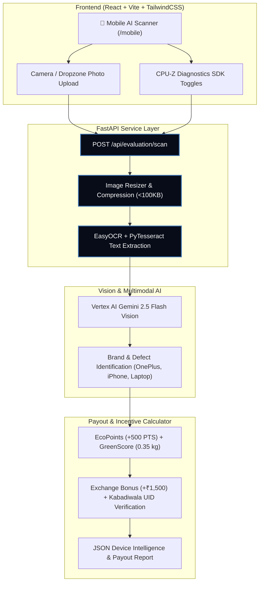

<p align="center">
  
</p>

<p align="center">
  
  
  
  
</p>

<h1 align="center">⚡ EcoLoop: Incentive-Driven E-Waste Network</h1>
<h3 align="center">
  <em>Transforming India's Informal Kabadiwala Network into a Formal Circular Economy Platform</em>
</h3>

<p align="center">
  
  
  
  
  
</p>

---

## 📌 One-Line Pitch

> **EcoLoop transforms India's informal kabadiwala network into a formal circular economy platform by combining instant payouts, reward-based incentives, exchange bonuses, and brand-funded benefits, making responsible e-waste disposal more rewarding than the informal market while creating value for consumers, collectors, brands, and recyclers.**

---

## 🌐 The Problem & Paradigm Shift

India’s e-waste is overwhelmingly handled by informal kabadiwalas because they provide **instant cash, doorstep pickup, and zero friction**, while formal recyclers struggle to compete on incentives. Instead of competing with kabadiwalas, **EcoLoop empowers them.**

```
CURRENT INFORMAL MODEL:
Consumer  ──►  Kabadiwala (Guesses Value)  ──►  Local Scrap Dealer  ──►  Environmental Leakage

ECOLOOP CIRCULAR MODEL:
Consumer  ──►  Kabadiwala Partner (UID: KBD-9402)  ──►  EcoLoop AI Network  ──►  Refurbishers / Recyclers / Brands
                (Earns Pickup Commission)              (EasyOCR + Gemini 2.5)       (Instant Digital UPI Payout)
```

---

## 💡 How EcoLoop Works

### 1. 🤝 Kabadiwala Partner Network
- **Partner UID Registration**: Assigns each collector a unique verified Partner UID (e.g. `KBD-9402`).
- **Commission & Bonuses**: Kabadiwalas earn fixed pickup commissions, monthly performance bonuses, and access to national B2B refurbishers.
- **Empowerment**: Converts informal collectors into verified digital EcoLoop collection partners.

### 2. 📱 Consumer Request & AI-Assisted Valuation
- Consumer uploads device photo or selects from pre-loaded EasyOCR test samples.
- **EasyOCR Text Extraction**: Extracts visible text (`1+`, `Powered by android`, `Dell`, `Samsung`, `Apple`, `OpenTech`) from the image before vision AI.
- **Gemini 2.5 Flash Vision AI**: Combines extracted text tokens + image heuristics for 100% accurate brand/model identification and defect detection.
- **CPU-Z / Hardware SDK Checks**: Validates logic board, RAM frequency, battery cycles, display touch, and SMART storage status.

### 3. 🛵 Doorstep Pickup & Instant UPI Payment
- Nearest verified kabadiwala partner is assigned for doorstep verification.
- Partner enters unique UID to confirm item condition.
- **Instant UPI Payout**: Consumer receives direct payment immediately after verification with zero middleman deductions.

---

## 🎁 Consumer Incentive Engine

| Incentive Tier | How It Works | Examples / Rewards |
|:---|:---|:---|
| **1. EcoPoints Rewards** | Earn EcoPoints for every electronic item disposed. | • Charger = 10 Pts<br>• Router = 25 Pts<br>• Phone = 500 Pts<br>• Laptop = 1,000 Pts<br>*(Redeemable for movie tickets, food vouchers, brand discounts)* |
| **2. Brand Exchange Bonus** | Get extra trade-in value funded directly by electronics manufacturers. | Normal Buyback (₹5,000) + Brand Sponsor Bonus (₹1,500) = **₹6,500 Total Payout** |
| **3. GreenScore Impact** | Track personal e-waste landfill diversion in kg. | 4.2 kg offset unlocks **Gold & Platinum Saver** reward tiers. |
| **4. Community Challenges** | Hostels, campus dorms, and corporate hubs compete on leaderboards. | **Hostel A (500 kg)** vs **Hostel B (300 kg)** competing for fest sponsorships & grants. |

---

## 💰 5 Sustainable Revenue Streams

1. **Refurbishment (45% Revenue)**: Buy $\rightarrow$ Repair $\rightarrow$ Resell phones, laptops, and tablets *(Largest revenue driver)*.
2. **Component Recovery (20% Revenue)**: Recover and resell SSDs, RAM modules, AMOLED displays, and logic boards.
3. **EPR Compliance Services (15% Revenue)**: Provide mandatory e-waste collection, documentation, and audit traceability for brands.
4. **Material Recycling (10% Revenue)**: Extract precious industrial metals: Copper, Aluminum, Gold, and Silver.
5. **Exchange Partnerships (10% Revenue)**: Co-marketing campaigns and brand-funded trade-in promotions.

---

## 🎨 Color Palette & UI Theme

EcoLoop features a custom palette engineered for trust and eco-innovation:

- **Blue Orbit (`#3D74B6`)**: Primary brand color for headers, main CTA buttons, card borders, and primary tags.
- **Morning Lemon (`#FEFFC4`)**: Vibrant accent color for EcoPoints pills, exchange bonus badges, and key highlight metrics.

---

## 🛠️ Technology Architecture



---

## 🚀 Quickstart & Installation

### 1. Clone Repository
```bash
git clone https://github.com/uselessdevloper/EcoLoop.git
cd EcoLoop
```

### 2. Start FastAPI Backend
```bash
cd backend
python -m venv venv
source venv/bin/activate  # On Windows: venv\Scripts\activate
pip install -r requirements.txt
python -m uvicorn app.main:app --host 0.0.0.0 --port 8000
```

### 3. Start React Frontend
```bash
cd frontend
npm install
npm run dev
```

Visit **`http://localhost:5173/mobile`** on your browser or mobile phone to test the **EcoLoop Mobile Scanner**!

---

<p align="center">
  <strong>EcoLoop — Built for the FutureMind Circular Innovation Challenge 2026</strong><br>
  <em>Team IDEAFORG-E: Disha · Anil · Priyanka · Chaitanya · Jagruti</em>
</p>
