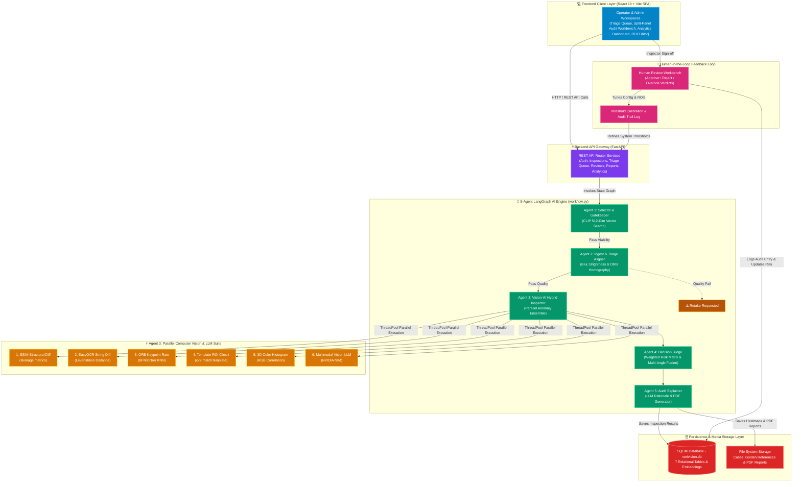

<p align="center">
  
</p>

<p align="center">
  
  
  
</p>

<h1 align="center">🔍 VeriVision AI</h1>
<h3 align="center">
  <em>Parts Fraud Detection using Computer Vision & Agentic AI</em>
</h3>

<p align="center">
  
  
  
  
  
  
  
  
  
</p>

---

## 👥 Team IDEAFORG-E

| Name | Role |
|:---|:---|
| **Disha** | Backend Dev |
| **Anil** | Agents Dev |
| **Priyanka** | Frontend Dev |
| **Chaitanya** | DataSet Collection  |
| **Jagruti** | Frontend Dev |

---

## 📖 The Problem — A Story That Costs Billions

> *Imagine a Tuesday morning at a global electronics repair hub. A pallet of 500 replacement motherboards arrives from a third-party vendor. They look perfect. The serial stickers are crisp. The packaging is intact. A technician picks one up, installs it in a customer laptop, and ships it out. Two weeks later, the customer calls — the board is dead. It was a counterfeit. One board out of 500. But finding it manually? That would have taken a human inspector 4 hours with a magnifying glass, comparing each board against a reference photo, squinting at serial numbers, checking if a "0" was swapped for an "O".*

> *Now multiply that across 15 repair sites, 50 vendors, and 10,000 parts per month.*

This is not a hypothetical. **This is the reality of global repair and manufacturing supply chains today.**

### The Numbers That Keep Supply Chain Leaders Awake

| Statistic | Scale |
|:---|:---|
| Global counterfeit trade | **$467 billion** annually (2.3% of global imports) — OECD |
| Electronics sector losses | **$100+ billion** per year |
| Companies hit by supply chain fraud | **47%** in the last 2 years |
| Defense sector counterfeit infiltration | Up to **15%** of components |
| Fraud Detection & Prevention market | **$54.6 billion** (2025) and growing |

The fraud is sophisticated. Tampered parts with broken QC seals. Labels where a warranty code has one character altered — `A00-00` becomes `A00-0O`. Boards returned as "new" that carry microscopic solder residue from previous use. Non-OEM stickers with slightly different hues that pass a casual glance but fail under pixel-level analysis.

**Manual inspection can't scale. It can't be consistent across sites. It can't catch a single altered character in a serial number at 3 AM on a night shift.**

The industry needs an AI system that can see what humans miss — automatically, consistently, and with audit-ready evidence.

---

## 💡 Our Solution — VeriVision AI

> [!NOTE]
> **Executive Summary**: VeriVision AI reduces inspection latency from 4+ hours per pallet down to milliseconds per part while capturing subtle fraud indicators like 0-to-O character alterations on serial stickers, missing QC tags, non-OEM replacement covers, and reused boards.

**VeriVision AI** is an end-to-end **Agentic AI platform** that replaces manual visual inspection with a deterministic, explainable, **5-agent computer vision pipeline** built on **LangGraph**. 

Upload an image of a part. The system automatically:
1. **Finds** the matching golden reference from a 512-dim visual embedding library (Open_CLIP ViT-B/32).
2. **Validates** image quality (blur, lighting, alignment) and warps target scan using ORB homography.
3. **Inspects** for anomalies using 6 parallel detection methods (SSIM, EasyOCR, Keypoint matching, Template ROI, 3D Color Histograms, Multimodal Vision LLM).
4. **Judges** the evidence with a weighted scoring matrix and Noisy-OR Multi-Angle Fusion engine.
5. **Explains** the verdict in natural language (NVIDIA NIM Text LLM or rule-based template) and exports a laboratory-grade PDF report.

No manual pairing. No subjective judgment. No inconsistency between sites.

### What Makes VeriVision Different

| Dimension | Traditional QC | VeriVision AI |
|:---|:---|:---|
| **Speed** | 4+ hours per pallet | ~3-5 seconds per part |
| **Consistency** | Varies by inspector, shift, fatigue | Deterministic — same input, same verdict |
| **Evidence** | Handwritten notes, verbal reports | JET Heatmaps, OCR character diffs, PDF audit trail |
| **Scalability** | 1 inspector per station | Unlimited concurrent parallel inspections |
| **Learning** | Tribal knowledge, no feedback loop | HITL feedback refines thresholds over time |
| **Fraud Types** | Catches obvious tampering | Catches 0→O character swaps, hue shifts, missing stickers, component swaps |

---

## 🏗️ High-Level System Architecture

<p align="center">
  
</p>

> [!IMPORTANT]
> **Deterministic 5-Agent Pipeline**: Powered by a **LangGraph State Machine** (`workflow.py`), every hardware scan follows a strict state transition path. Low-quality scans trigger instant retake guidance, preventing distorted images from wasting inference compute.



---

## 🛠️ Complete Technology Stack

| Layer / Category | Technology | Version / Spec | Purpose & Role |
|:---|:---|:---|:---|
| **Frontend Framework** |  | `18.3.1` | Modern component-based Single Page Application (SPA) |
| **Frontend Build Tool** |  | `5.2.0` | Development server with Hot Module Replacement (HMR) |
| **Styling & Theme** |  | `3.4.3` | Utility-first styling with custom dark/light mode glassmorphic tokens |
| **UI Components & Icons** |  | `0.344.0` | Industrial QA icon set for audit status & navigation |
| **Data Visualization** |  | `3.9.2` | Interactive charts for vendor risk, site breakdown, and monthly fraud trends |
| **Routing & Protection** |  | `6.22.3` | Declarative client-side routing with role-based `ProtectedRoute` guards |
| **Backend API Gateway** |  | `0.100.0+` | Asynchronous REST API framework |
| **Server ASGI** |  | `0.22.0+` | ASGI web server running backend endpoints |
| **Agentic Workflow** |  | `0.0.1+` | Directed acyclic graph orchestrating 5 autonomous AI agents |
| **Deep Learning Engine** |  | `torch 2.0+` | Deep learning framework for visual neural embeddings |
| **Neural Vector Search** |  | `ViT-B/32` | Extracts 512-dimensional visual embeddings for sub-10ms similarity matching |
| **Computer Vision Engine** |  | `4.7.0+` | Homography image registration, Laplacian blur check, and JET heatmap overlays |
| **Structural Metrics** |  | `0.20.0+` | Structural Similarity Index (SSIM) matrix calculation |
| **Text Extraction (OCR)** |  | `1.7.0+` | Optical Character Recognition for serial numbers & character diffs |
| **Multimodal Vision & LLM** |  | REST API (`meta/llama-3.2-11b-vision-instruct` & `meta/llama-3.1-8b-instruct`) | TensorRT-LLM hosted vision inspection (~1.2s) & executive audit explainer (~0.3s) |
| **PDF Report Generator** |  | `4.0.0+` | Generates laboratory compliance PDF certificates with embedded heatmaps |
| **Database Engine** |  | SQLite 3 | Embedded relational database storing cases, products, and audit trails |

---

## ⚡ Quick Start & One-Click Setup Guide

### Option A: One-Click PowerShell Launcher (Windows)
Double-click `run.ps1` in the root directory. It automatically sets up Python virtual environments, installs frontend/backend dependencies, starts the FastAPI backend, and launches the Vite React dev server.

```powershell
.\run.ps1
```

### Option B: Manual Step-by-Step Setup

#### 1. Backend Service Setup
```bash
cd backend
python -m venv venv
# On Windows PowerShell:
.\venv\Scripts\Activate.ps1
# On Linux/macOS:
source venv/bin/activate

pip install -r requirements.txt
python seed_db.py
uvicorn app.main:app --reload --port 8000
```

#### 2. Frontend SPA Setup
```bash
cd frontend
npm install
npm run dev
```

#### 3. Environment Variables Configuration (`backend/.env`)
Copy `backend/.env.example` to `backend/.env`:
```env
# Security & Authentication
SECRET_KEY=verivision_super_secret_key_change_me_in_production
ALGORITHM=HS256
ACCESS_TOKEN_EXPIRE_MINUTES=1440

# NVIDIA NIM Integration (Ultra Low Latency TensorRT-LLM Microservices)
NVIDIA_NIM_API_KEY=your_nvidia_nim_api_key_here
NVIDIA_NIM_BASE_URL=https://integrate.api.nvidia.com/v1
NVIDIA_VISION_MODEL=meta/llama-3.2-11b-vision-instruct
NVIDIA_TEXT_MODEL=meta/llama-3.1-8b-instruct

# OpenRouter API Integration (Fallback Provider)
OPENROUTER_API_KEY=your_openrouter_api_key_here
OPENROUTER_MODEL=nvidia/nemotron-nano-12b-v2-vl:free

# Database Connection
DATABASE_URL=sqlite:///./verivision.db
```

> [!NOTE]
> **Graceful Fallback**: VeriVision AI functions fully out-of-the-box offline. EasyOCR, Open_CLIP embeddings, SSIM, and local template explainers run completely locally without requiring external API keys.

---

## 🔑 Demo Credentials

| Role | Email | Password | Access |
|:---|:---|:---|:---|
| **Admin** | `admin@verivision.com` | `admin123` | Full access: Triage Queue, Catalog Portal, Calibration Console, Analytics, Reviews |
| **Operator** | `user@verivision.com` | `user123` | Triage Queue, Inspection Submission, Human Review Workbench |

---

## 🎯 Test Scenarios Supported

| # | Scenario | Detection Method | Category | Expected Action |
|:--|:---|:---|:---|:---|
| 1 | Missing QC label | Template ROI + SSIM delta | Missing | Quarantine & Escalate |
| 2 | Altered serial number (0→O) | EasyOCR + Levenshtein diff | Mismatched | Escalate with evidence |
| 3 | Reused board with residue | SSIM + keypoint anomaly | Reused / Tampered | Request additional angle |
| 4 | False alarm (lighting) | Triage agent detects exposure issue | Clean (after retake) | Triage requests retake |
| 5 | Non-OEM label (different hue) | 3D Color histogram correlation | Mismatched | Vendor verification |
| 6 | Component swap | Keypoint mismatch spike | Tampered | Quarantine & Escalate |

---

## 📋 Data Contracts & Key API Schemas

### 1. Scan Submission Contract (`POST /api/inspections`)
```json
// Request: Multipart Form-Data (image: File, metadata: Form)
{
  "product_id": 1,
  "capture_site": "Repair Center Alpha - Austin",
  "capture_angle": "top",
  "vendor": "Vendor A",
  "component_name": "Dell DDR5 RAM"
}

// Response: Inspection Case Object (HTTP 200 OK)
{
  "case_id": "c9a4f210-5b8e-4a1d-9e32-123456789abc",
  "status": "completed",
  "created_at": "2026-07-24T09:30:00Z",
  "result": {
    "fraud_score": 95,
    "verdict": "tampered",
    "confidence": 0.98,
    "recommended_action": "Quarantine & Escalate",
    "explanation": "SSIM heatmap analysis registered a structural similarity index of 0.35...",
    "heatmap_path": "/data/cases/c9a4f210_heatmap.png"
  }
}
```

### 2. Human Review Action Contract (`POST /api/reviews/{case_id}`)
```json
// Request Payload
{
  "action": "override",        // "approve" | "reject" | "override"
  "override_verdict": "clean", // Mandatory if action == "override"
  "comments": "Inspected under optical microscope. Component swap concern cleared."
}
```

---

## 📊 Judging Alignment

| # | Criterion | How VeriVision Addresses It |
|:--|:---|:---|
| 1 | Solution Quality | End-to-end pipeline: upload → detect → score → explain → report → review |
| 2 | Tool Stack Used | LangGraph, CLIP, PyTorch, OpenCV, EasyOCR, NVIDIA NIM, FastAPI, React 18, Recharts |
| 3 | Presentation & Pitch | Narrative README, live demo, architecture diagrams |
| 4 | Feasibility & Integration | REST API design, one-click launcher, configurable thresholds, SQLite portability |
| 5 | Innovation & Originality | 6-method parallel ensemble, Noisy-OR multi-angle fusion, CLIP auto-reference matching |
| 6 | Modularity & Reusability | Each agent is an independent service; LangGraph nodes are plug-and-play |
| 7 | Impact Potential | Addresses $100B+ electronics fraud problem; scales to any repair/logistics operation |
| 8 | Testing & Validation | 6 test scenarios covering all fraud categories including false-alarm handling |
| 9 | User Experience & Design | Glassmorphism UI, light/dark mode, drag-and-drop upload, split-panel workbench |
| 10 | Documentation Clarity | This README + `AGENTS.md` + inline code documentation + API docs at `/docs` |
| 11 | Security & Privacy | JWT auth, RBAC, audit logging, hash provenance, minimal data retention |
| 12 | Explainability & Transparency | Per-region heatmaps, OCR character diffs, LLM narratives grounded in measured metrics |
| 13 | Feedback Loop / Learning | HITL Approve/Reject/Override → audit logs → threshold tuning → improved future detections |

---

<p align="center">
  <strong>Built with ❤️ by Team IDEAFORG-E for the Dell FutureMind AI Hackathon Grand Final 2026</strong>
</p>
<p align="center">
  <em>Disha · Anil · Priyanka · Chaitanya · Jagruti</em>
</p>
