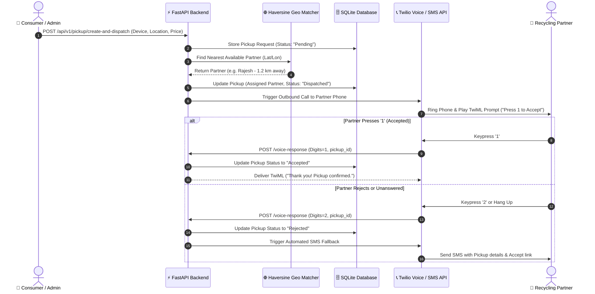

# 📞 EcoLoop Call — Automated Partner Dispatch & Interactive Twilio Voice/SMS System

[](https://fastapi.tiangolo.com/)
[](https://www.twilio.com/)
[](https://www.sqlite.org/)
[](https://react.dev/)
[](https://tailwindcss.com/)

> **EcoLoop Call** is the voice, SMS, and geolocation dispatch backbone of the **EcoLoop** Smart E-Waste Recycling Platform. It connects consumer recycling pickup requests with nearest available field pickup partners using real-time Haversine distance calculations, automated Twilio Voice IVR calls, interactive DTMF keypress response handling, and instant SMS fallback notifications.

---

## 📑 Table of Contents
- [🌟 Platform Overview](#-platform-overview)
- [🔄 Automated Dispatch & Call Workflow](#-automated-dispatch--call-workflow)
- [✨ Core Features](#-core-features)
- [📂 Project Directory Structure](#-project-directory-structure)
- [🛠️ Tech Stack](#️-tech-stack)
- [🔑 Environment Setup (.env)](#-environment-setup-env)
- [🚀 Quickstart & Installation](#-quickstart--installation)
  - [1. Backend Setup (FastAPI)](#1-backend-setup-fastapi)
  - [2. Frontend Setup (Vite + React)](#2-frontend-setup-vite--react)
  - [3. Twilio Webhook Tunnel Setup (Ngrok)](#3-twilio-webhook-tunnel-setup-ngrok)
- [🤖 Twilio Studio Flow Provisioning](#-twilio-studio-flow-provisioning)
- [📡 API Endpoint Reference](#-api-endpoint-reference)
  - [Partner & Geolocation API (`/api/v1/partner`)](#partner--geolocation-api-apiv1partner)
  - [Pickup Logistics & Dispatch API (`/api/v1/pickup`)](#pickup-logistics--dispatch-api-apiv1pickup)
  - [Twilio Voice & SMS Webhooks (`/api/v1/twilio`)](#twilio-voice--sms-webhooks-apiv1twilio)
- [📄 License & Authors](#-license--authors)

---

## 🌟 Platform Overview

When consumers submit e-waste recycling pickup requests, **EcoLoop Call** executes an automated end-to-end dispatch sequence:
1. **Consumer Request**: Collects device details, coordinates (latitude/longitude), and estimated recycling payouts.
2. **Geo-Matching**: Evaluates active field recycling partners in real time using the **Haversine formula** to select the closest available partner.
3. **Automated Voice IVR Call**: Initiates a Twilio voice call to the assigned partner with dynamic TwiML audio prompt (`"Press 1 to accept the pickup request"`).
4. **Keypress Processing**: Evaluates DTMF inputs (`Digits == 1` updates status to `Accepted`, other inputs set status to `Rejected`).
5. **SMS Fallback Notification**: If the call is rejected or unanswered, the platform automatically triggers an SMS containing pickup details and location links.

---

## 🔄 Automated Dispatch & Call Workflow



---

## ✨ Core Features

- 🗺️ **Haversine Geo-Location Dispatch Engine**: Calculates exact spherical distance between consumer pickup coordinates and available partners, ignoring offline or busy partners.
- 📞 **Dynamic TwiML Voice Call Generation**: Generates standard compliant TwiML XML responses with customizable greeting prompts, gathering DTMF responses directly over telephone lines.
- 💬 **Automatic SMS Fallback**: Built-in resilience layer that dispatches instant SMS alerts containing pickup coordinates and customer details whenever a call goes unanswered or is explicitly declined.
- 🤖 **Programmatic Twilio Studio Provisioning**: Includes standalone Python tools (`create_twilio_flow.py`) and JSON schemas (`studio_flow.json`) to provision visual IVR workflows on Twilio cloud infrastructure.
- 🗄️ **FastAPI + SQLAlchemy Architecture**: SQLite persistence with automatic table migrations and seed initialization for sample partners (*Rajesh*, *Amit*, *Suresh*).
- 💻 **Dual Frontend Interfaces**: Complete React + Vite + Tailwind CSS management dashboard alongside a single-file `standalone.html` interface for immediate testing.

---

## 📂 Project Directory Structure

```text
ecoloopcall/
├── app/
│   ├── __init__.py           # App package initialization
│   ├── config.py             # Pydantic environment configuration & settings
│   ├── database.py           # SQLAlchemy engine, SessionLocal & Base declaration
│   ├── main.py               # FastAPI entrypoint, CORS setup & route aggregation
│   ├── models.py             # SQLAlchemy models (Partner, Pickup)
│   └── schemas.py            # Pydantic models & request/response validation schemas
│
├── routers/
│   ├── __init__.py           # Routers package initialization
│   ├── partner_router.py     # Endpoints for Partner registration, status & geo-matching
│   ├── pickup_router.py      # Endpoints for Pickup creation, dispatch & lifecycle
│   └── twilio_router.py       # TwiML webhooks, voice response callbacks & SMS replies
│
├── services/
│   ├── __init__.py           # Services package initialization
│   ├── dispatch_service.py   # High-level pickup dispatch coordination logic
│   ├── geo_service.py        # Haversine distance math & nearest-partner search
│   ├── notification_service.py# Multi-channel alert dispatch & fallback routing
│   ├── partner_service.py    # CRUD & seed management for partners
│   ├── pickup_service.py     # CRUD & status transitions for pickup requests
│   ├── sms_service.py        # Low-level Twilio SMS client wrapper
│   ├── twilio_service.py     # Low-level Twilio Call & TwiML generator
│   └── twilio_studio_service.py # Twilio Studio Flow execution bridge
│
├── frontend/
│   ├── src/                  # React dashboard source files
│   ├── index.html            # Vite HTML template
│   ├── standalone.html       # Standalone single-file frontend dashboard
│   ├── package.json          # Node.js dependencies
│   ├── tailwind.config.js    # Tailwind CSS styling configuration
│   └── vite.config.js        # Vite bundler configuration
│
├── create_twilio_flow.py     # Script to provision Twilio Studio Flow via REST API
├── studio_flow.json          # Exported Twilio Studio Flow definition
├── ecoloop.db                # Local SQLite database (Auto-generated)
├── .env.example              # Environment variables template file
├── requirements.txt          # Python dependencies
└── README.md                 # Project documentation
```

---

## 🛠️ Tech Stack

- **Backend**: Python 3.10+, FastAPI, SQLAlchemy, Pydantic v2, Uvicorn
- **Telephony & Messaging**: Twilio REST API, TwiML XML, Twilio Studio
- **Database**: SQLite
- **Frontend**: React, Vite, Tailwind CSS, JavaScript (ES6+)
- **Developer Tools**: Ngrok (Webhook tunneling), Git

---

## 🔑 Environment Setup (.env)

Copy `.env.example` to `.env` in the root directory and configure your credentials:

```bash
cp .env.example .env
```

Set the following variables inside `.env`:

```env
PROJECT_NAME="EcoLoop Call API"
PROJECT_VERSION="1.0.0"
DATABASE_URL="sqlite:///./ecoloop.db"
DEBUG=True

# Twilio Telephony Credentials
TWILIO_ACCOUNT_SID="ACXXXXXXXXXXXXXXXXXXXXXXXXXXXXXXXX"
TWILIO_AUTH_TOKEN="your_twilio_auth_token_here"
TWILIO_PHONE_NUMBER="+1234567890"

# Public Webhook Base URL (Ngrok tunnel URL for live call testing)
TWILIO_WEBHOOK_BASE_URL="https://your-ngrok-subdomain.ngrok-free.app"
TWILIO_STUDIO_FLOW_SID="FWXXXXXXXXXXXXXXXXXXXXXXXXXXXXXXXX"
```

---

## 🚀 Quickstart & Installation

### 1. Backend Setup (FastAPI)

1. Navigate to the `ecoloopcall` directory:
   ```bash
   cd ecoloopcall
   ```

2. Install Python dependencies:
   ```bash
   pip install -r requirements.txt
   ```

3. Launch the FastAPI server:
   ```bash
   uvicorn app.main:app --reload --port 8000
   ```

4. Verify backend health:
   - **Swagger Interactive API Docs**: [http://127.0.0.1:8000/docs](http://127.0.0.1:8000/docs)
   - **ReDoc API Docs**: [http://127.0.0.1:8000/redoc](http://127.0.0.1:8000/redoc)
   - **Health Endpoint**: [http://127.0.0.1:8000/health](http://127.0.0.1:8000/health)

---

### 2. Frontend Setup (Vite + React)

1. Open a new terminal and navigate to `frontend`:
   ```bash
   cd frontend
   npm install
   ```

2. Start the development server:
   ```bash
   npm run dev
   ```

3. Open [http://localhost:5173](http://localhost:5173) in your browser.

> 💡 **Quick Demo Alternative**: You can also double-click `frontend/standalone.html` to run the UI directly without requiring Node.js!

---

### 3. Twilio Webhook Tunnel Setup (Ngrok)

To enable live Twilio voice calls and webhook callbacks from Twilio servers to your local machine:

1. Start an Ngrok HTTP tunnel on port 8000:
   ```bash
   ngrok http 8000
   ```

2. Copy the generated HTTPS forwarding URL (e.g. `https://a1b2c3d4.ngrok-free.app`).
3. Update `TWILIO_WEBHOOK_BASE_URL` in your `.env` file with this URL.

---

## 🤖 Twilio Studio Flow Provisioning

`ecoloopcall` includes a built-in automated script to configure your Twilio Studio IVR workflow:

```bash
python create_twilio_flow.py
```

This reads `studio_flow.json` and creates/updates a **Twilio Studio Flow** under your Twilio account, setting up:
- Voice trigger initialization
- Interactive text-to-speech prompts
- Keypress gather widget (`Press 1 to accept`)
- Webhook callback dispatching to your FastAPI server

---

## 📡 API Endpoint Reference

### Partner & Geolocation API (`/api/v1/partner`)

| Method | Endpoint | Description |
|:---|:---|:---|
| `POST` | `/partner` | Register a new recycling partner |
| `GET` | `/partner` | Retrieve list of all partners (Auto-seeds initial partners) |
| `GET` | `/partner/{id}` | Get partner details by ID |
| `GET` | `/partner/match` | Find nearest available partner for given Lat/Lon via Haversine |
| `GET` | `/partner/match-all` | List all available partners sorted by distance |
| `PATCH` | `/partner/status` | Update partner availability status (`available`, `busy`, `offline`) |

### Pickup Logistics & Dispatch API (`/api/v1/pickup`)

| Method | Endpoint | Description |
|:---|:---|:---|
| `POST` | `/pickup` | Create a new consumer e-waste pickup request |
| `POST` | `/pickup/create-and-dispatch` | Create pickup & auto-dispatch nearest partner + trigger call |
| `POST` | `/pickup/{id}/dispatch` | Trigger auto-dispatch & Twilio voice call for existing pickup |
| `GET` | `/pickup` | List all pickup requests (filterable by status) |
| `GET` | `/pickup/{id}` | Get pickup details by ID |
| `POST` | `/pickup/{id}/assign` | Assign a specific partner to a pickup |
| `PATCH` | `/pickup/{id}/status` | Update pickup state (`Pending`, `Dispatched`, `Accepted`, `Rejected`, `Completed`) |

### Twilio Voice & SMS Webhooks (`/api/v1/twilio`)

| Method | Endpoint | Description |
|:---|:---|:---|
| `GET / POST` | `/twilio/voice` | Webhook returning TwiML XML call script |
| `GET / POST` | `/twilio/voice-response` | Callback processing partner keypress (Updates status & triggers SMS fallback if rejected) |
| `GET / POST` | `/twilio/sms-reply` | Webhook processing incoming partner SMS replies |
| `POST` | `/twilio/call-partner` | Trigger outbound automated phone call to partner |

---

## 📄 License & Authors

Built with ❤️ for **EcoLoop — Smart E-Waste Recycling & Logistics Platform**.
